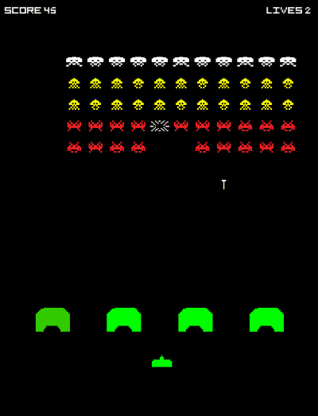

# rizz-space-invaders
Space Invaders game remake with [_rizz_](https://github.com/septag/rizz) framework

It demonstrates how to make a simple game with _rizz_ and shows multiple features, which some of them were not necessary for this type of game, but implemented as a test for the framework:

- Basic game setup and initialization
- 2D Sprites and basic animations
- Audio
- Input (keyboard + gamepad)
- Coroutines (scene transitions)
- Job Dispatcher (used for collision detection, which is silly in this case of course!)
- Fonts and text



## Build

First, clone the _rizz_ and _space-invaders_ repos to your root project folder:

```
cd projects
git clone git@github.com:septag/rizz.git
git clone git@github.com:septag/rizz-space-invaders.git
```

Go to _space-invaders_ directory and configure with _cmake_. 

**Example**: To build for visual studio 2019:

```
cd rizz-space-invaders
cd build-vc16
cmake ..\src -G "Visual Studio 16 2019" 
```

Then simply open the visual studio solution, build and run! 

Please **note** that you need to set working directory to _space-invaders_ project root (`$(ProjectDir)..\` in msvc), and because that the current build type is HOST (see [Host vs Bundle](http://glitterbombg.com/devblog/posts/rizz-basics/#builds/“host”vs.“bundle”build) builds), you need to run the game through rizz host executable. which will be `rizz.exe --run space-invaders.dll`. For msvc debugger, it would be `bin\$(Configuration)\rizz.exe --run bin\$(Configuration)\space-invaders.dll` for command-line arguments.

**Example**: To build the game in bundle mode (stand-alone executable), configure the project using previous commands and set BUNDLE properties:

```
cmake ..\src  -G "Visual Studio 16 2019"  -DBUNDLE=1 -DBUNDLE_TARGET=space-invaders -DBUNDLE_TARGET_NAME=space_invaders -DBUNDLE_PLUGINS="imgui;sound;2dtools;input" 
```

These arguments indicate that we are building stand-alone executable (BUNDLE=1), target name is `space_invaders` (name of the game in main.c), and cmake project name is `space-invaders` (-DBUNDLE_TARGET=space-invaders). And needs to embed multiple plugins: `imgui/sound/2dtools/input`.

## Controls
Use left/right arrow keys to move and _SPACE_ to shoot.  
You can also use gamepad (xbox controller), left analog stick to move and A key too shoot.


